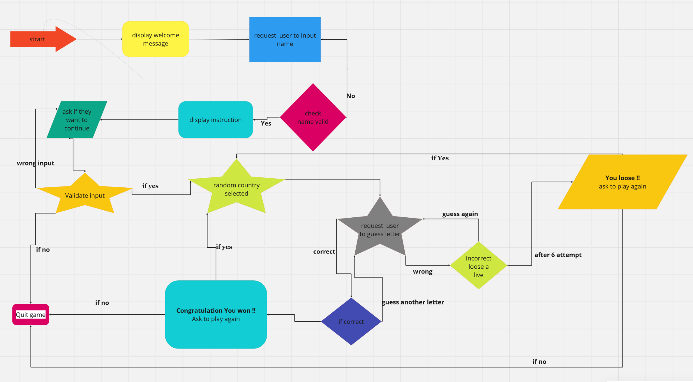
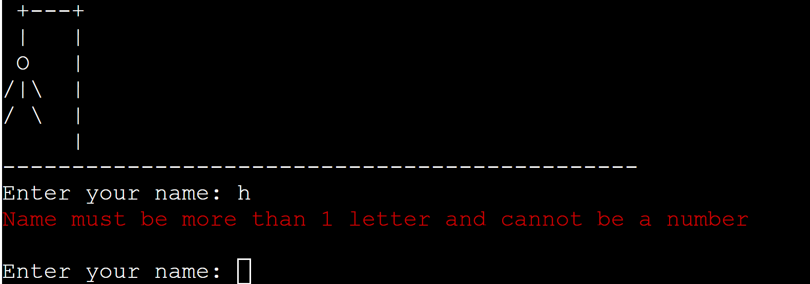
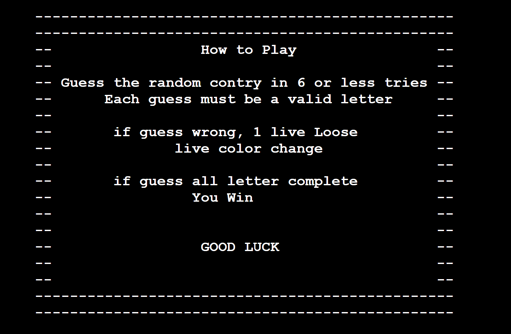
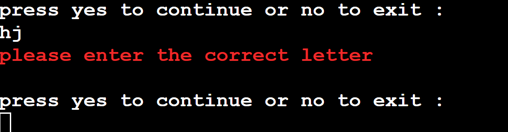
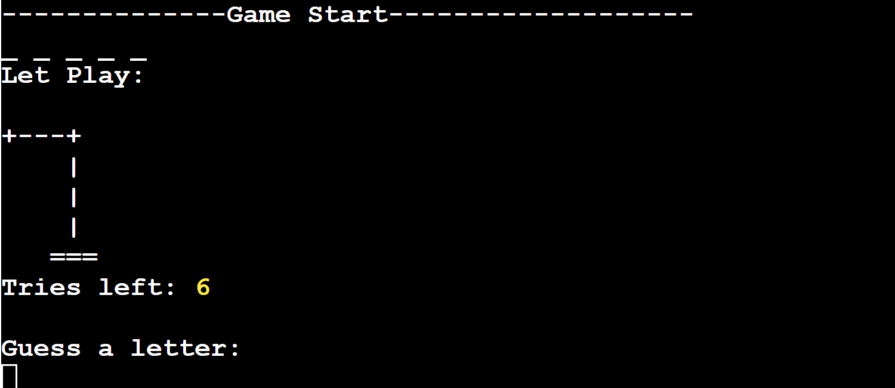
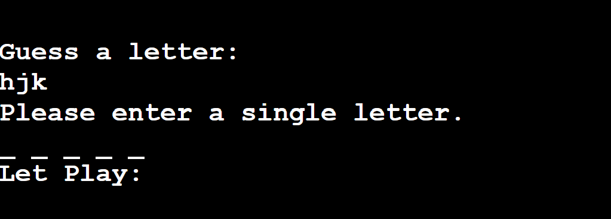
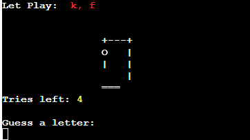
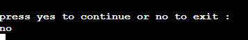

## The Hangman Game
The hangman game is to guess by the row of dashes representing each latter of the word, guess the countries by the dashes provided, the user must guess the random country within 6 try, 

The game is mixed of countries name around the world, 

The link can be found here - [Game-Hang](https://the-hangman-game-b58499e0ed83.herokuapp.com/)

## How to play 

- The player have 6 chances to guess a random letter base on the dashes provided 
- If player guesses the correct word within 6 try they won the game
- The player get a drawing of the Hangman if they guess the wrong word,

## Aim

- Provied user with anapp that functions well and easy to use
- To provide the user with good knowledge

# Flow Chart

## Features

# Title and start up 

1. Welcome message as the site run and ask the user to enter 
2. A display message text create using the Pyfiglet which takes ASCII text and renders it into ASCII art fonts

While entering the name, a strong validation to make sure the player enter more than 1 letter, 
a message appear in red to tell the user to input the correct details 

# instruction message display

- Display messages on how to play the game

# continue game play or exit game

- if wrong input entered, an error message display 

# Game Play 

- Game proceed and ask the user to fill in the blank 

- if user enter more than 1 letter or incorrect digit, a display message appear

- If user guess incorrect letter, an error of the incorrect letter is displayed and hangman build up

# Bug 
- When running the Game in Heroku app, the game freeze if the user choose to quit the game after the instruction, 

-while running the game through the Gitpod terminal, no issue att all 

# Libraries and Technologies Used

- random.choice is used to select a random word for the game from a text file.
- gspread: to allow communication with Google Sheets.
- pandas - used for sorting and displaying leaderboard data in user-friendly format.
- pyfiglet - for taking ASCII text and rendering it into ASCII art fonts.
- colorama - for adding colour to terminal text.

# Programs Used
- [GitHub](https://github.com/) - used for version control.
- [Heroku](heroku.com/apps) - used to deploy the live project.
- [FlowChart](miro.com)- used to create the game flowchart

# Deployment 
- The page was deployed via Heroku [Heroku](heroku.com/apps)  and link to page : [Game-Hang](https://the-hangman-game-b58499e0ed83.herokuapp.com/)
- 
- The steps were taken : 

-   1.  Log in to [Heroku](heroku.com/apps) or create an account.
-   2.  On the main page click the button labelled New in the top right corner and from the drop-down menu select "Create New App".
-   3.  Enter a unique and meaningful app name.
-   4.  Next select your region.
-   5.  Click on the Create App button.
-   6.  Click on the Settings Tab and scroll down to Config Vars.
-   7.  Click Reveal Config Vars and enter port into the Key box and 8000 into the Value box and click the Add button.
-   8.  Input CREDS and the content of your Google Sheet API creds file as another config var and click add.
-   9.  Next, scroll down to the Buildpack section click Add Buildpack select Python and click Save Changes
-   10. Repeat step 11 to add node.js. Note: The Buildpacks must be in the correct order. If not click and drag them to move into the correct order.
-   11. Scroll to the top of the page and choose the Deploy tab.
-   12. Select Github as the deployment method.
-   13. Confirm you want to connect to GitHub.
-   14. Search for the repository name and click the connect button.
-   15. Scroll to the bottom of the deploy page and either click Enable Automatic Deploys for automatic deploys or Deploy Branch to deploy manually.                Manually                   
        deployed branches will need re-deploying each time the repo is updated.
-   16. Click View to view the deployed site.

# Resources Used
- [W3Schools](https://www.w3schools.com/python/) - Assist with some Python variables
- [Stack Overflow](https://stackoverflow.com/) - for any question to resolve any issue 
- [colorama](https://pypi.org/project/colorama/) - to change the text color
- [ASCII aRT](https://pypi.org/project/art/) - I used this ASCII art for the border around the instructions.

# Code not used 
- Google Api 

# Improvement 
- Set up a date collection to store each user score in a spreadshot 